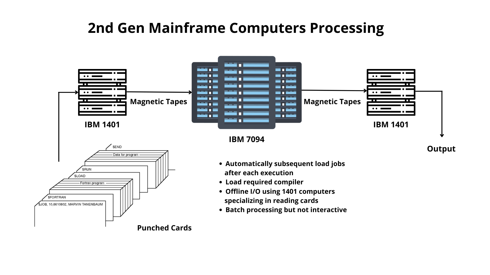

### Highlights the need of operating systems and it's role in getting the most out of computing devices with advancement of hardware and technology.

Evolution of operating systems is closely tied  to the technological progress, architecture, computing workflows and adoption by various groups and businesses.

<h3 align="center"> OS evolution mapped to Computer Generations </h3>

 

 &nbsp; &nbsp; 

 &nbsp; &nbsp; 

 

<h3 align="center"> Key factors entailing evolution of Operating Systems </h3>

 

<h3 align="center"> A look at typical 2nd gen computing workflow (mainframes) </h3>

