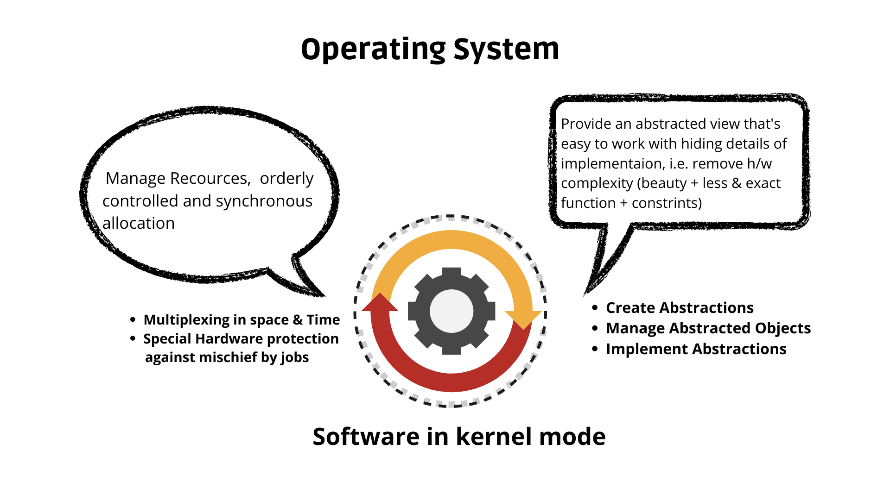
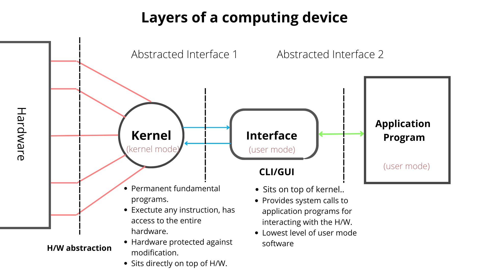
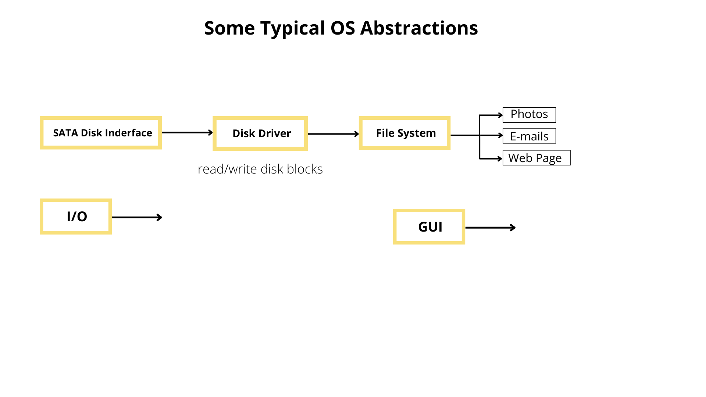

# Operating System

### Everything about OS from 'why' to 'how', a repository to 'not' learn OS ;) Get ready for a whirlwind tour!!

Section featuring core concepts of OS and impactful visualizations of various OS topics which easily allows anyone to gain intuition about the subject.
Attempt has been made to be abstract while presenting the ideas or motivation as well as thorough about the details and intricacies wherever required.

 

### **Software Layers and interactions**

Where does the OS fit in a computing system and how it achieves it's purpose of providing neat abstractions to user applications. Here is a high level look 
at the arrangement of software layers, the abstractions they provide and the interface they expose to the next layer. 

Note :- The kernel (OS) always runs on bare hardware.

 

 
 
 

### **Abstractions**

